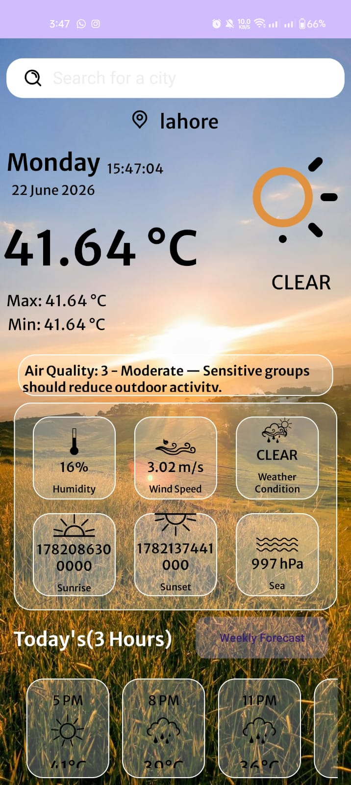
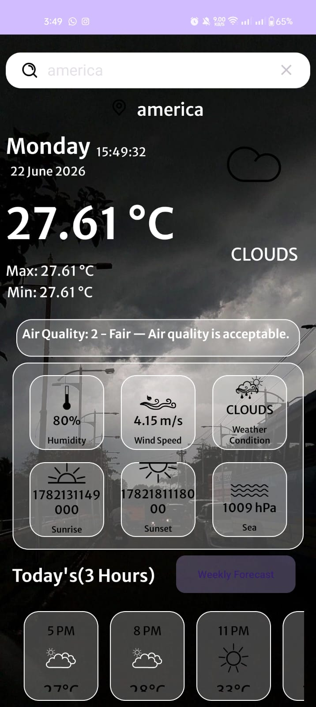
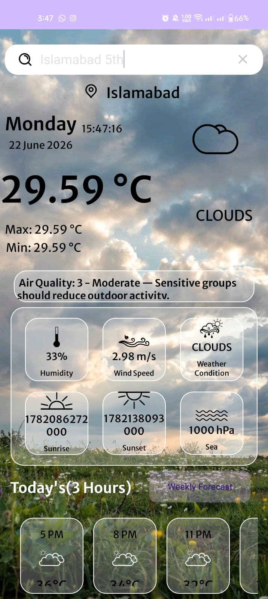
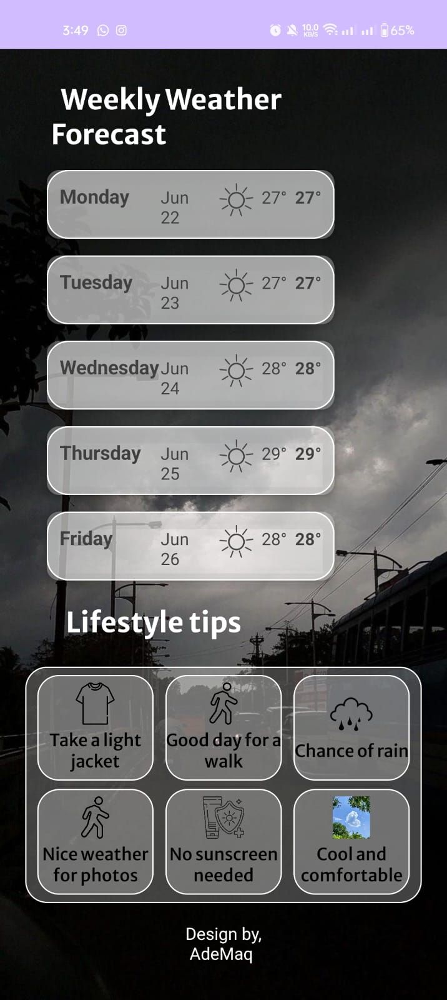

# Weather App

This is a weather application for Android.

## Screenshots

  
  
  
  
  

## Features

*   Displays current weather conditions
*   Provides hourly and weekly weather forecasts.
*   Shows air quality information.
*   Offers lifestyle tips based on the weather.

## Technologies Used

*   **Kotlin:** The primary programming language for the application.
*   **Android SDK:** The platform for building the Android app.
*   **Retrofit:** A type-safe HTTP client for Android and Java.
*   **Gson:** A Java library that can be used to convert Java Objects into their JSON representation.
*   **Lottie:** A mobile library for Android and iOS that parses Adobe After Effects animations exported as json with Bodymovin and renders them natively on mobile!
*   **Material Components for Android:** Modular and customizable Material Design UI components for Android.
*   **AndroidX Libraries:**
    *   Core KTX
    *   AppCompat
    *   ConstraintLayout
    *   RecyclerView

## Running the Project

To run this project, you will need Android Studio. You can run the app on an Android emulator or a physical device.

### Using the Android Emulator

1.  **Set up an Android Virtual Device (AVD):**
    *   In Android Studio, go to **Tools > AVD Manager**.
    *   Click **Create Virtual Device**.
    *   Choose a device definition and click **Next**.
    *   Select a system image and click **Next**.
    *   Verify the configuration and click **Finish**.

2.  **Run the app on the emulator:**
    *   Select the AVD you created from the toolbar.
    *   Click the **Run** button (green play icon) to start the emulator and run the app.

### Using a Physical Device

1.  **Enable USB debugging on your device:**
    *   On your Android device, go to **Settings > About phone**.
    *   Tap **Build number** seven times to enable Developer options.
    *   Go back to the main Settings menu and select **Developer options**.
    *   Enable **USB debugging**.

2.  **Connect your device to your computer:**
    *   Connect your device to your computer using a USB cable.
    *   A dialog will appear on your device asking you to allow USB debugging. Tap **OK**.

3.  **Run the app on your device:**
    *   Select your device from the toolbar in Android Studio.
    *   Click the **Run** button to install and run the app on your device.
